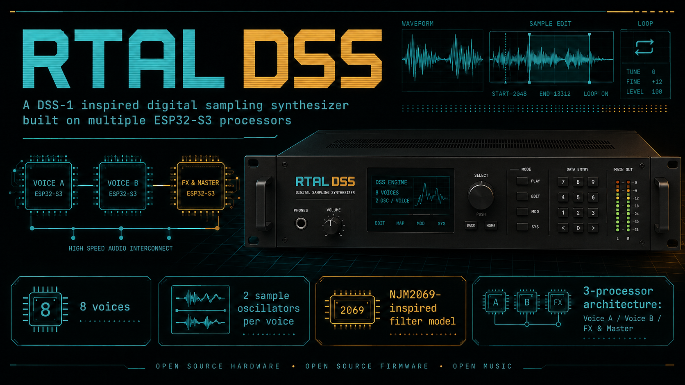
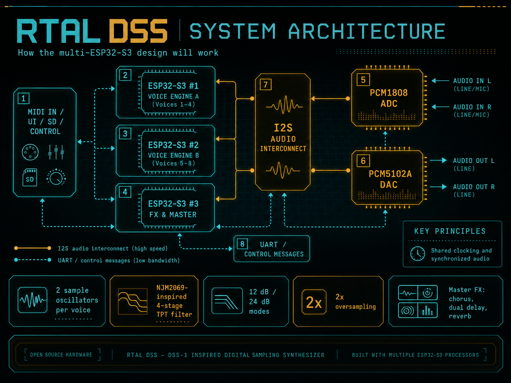
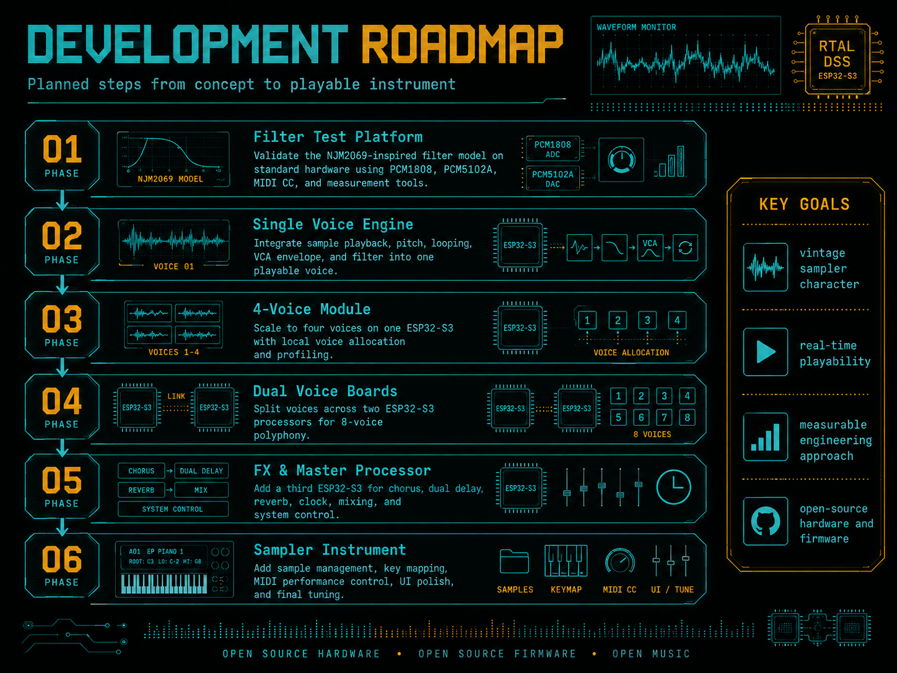

# RTAL-EAI-006-Digital_Sampling_Synthesizer_DSS

> **A multi-processor digital sampling synthesizer inspired by the architecture and sonic philosophy of the Korg DSS-1**

<

---

## A modern tribute to the digital sampling synthesizer

**RTAL DSS** is an open-source hardware and firmware project that explores how the core concept of the classic **Korg DSS-1** can be reinterpreted with modern embedded technology.

The original DSS-1 was never just a sampler.

It treated sampled audio as oscillator material inside a complete synthesizer voice architecture: two digital oscillators, envelopes, modulation, analog filtering, analog amplification and onboard effects. Its character emerged from the interaction between early digital sampling technology and a powerful subtractive synthesis signal path.

RTAL DSS follows the same fundamental idea:

> **The sample is not the finished sound. It is the starting point of the synthesis process.**

The project is not intended to be a literal hardware clone. Instead, it aims to capture the musical qualities that make instruments such as the DSS-1 so compelling:

- raw and characterful sample transposition
- two sample oscillators per voice
- strong resonant filtering
- nonlinear signal stages
- playable synthesis rather than passive sample playback
- a large, animated sound created from deliberately limited resources

To make this possible on an embedded platform, the instrument is planned around a distributed architecture using **three ESP32-S3 processors**.

---

## Project concept

RTAL DSS is designed as an **8-voice digital sampling synthesizer**.

Each voice is planned to contain:

- two sample oscillators
- independent pitch and tuning
- sample start, end and loop handling
- key mapping and multisample selection
- pitch modulation
- filter envelope
- amplifier envelope
- velocity control
- an NJM2069-inspired nonlinear filter and VCA model
- per-voice panning and level control

The complete instrument will combine the eight voices with a dedicated effects and master-processing engine.

```text
Sample Oscillator 1 ─┐
                     ├─ Voice Mixer ─ Drive ─ VCF ─ VCA ─ Pan
Sample Oscillator 2 ─┘
```

The initial target is not maximum technical perfection or an ultra-clean modern sampler.

The goal is a distinctive hardware instrument with:

- vintage digital texture
- strong filter movement
- controlled nonlinearities
- direct MIDI playability
- stable real-time performance
- measurable and reproducible DSP behavior

---

## Why multiple ESP32-S3 processors?

A single ESP32-S3 can already perform a surprising amount of real-time audio processing. However, an eight-voice instrument with two oscillators per voice, nonlinear oversampled filters, envelopes, modulation, effects, storage and user-interface tasks can quickly become constrained.

RTAL DSS therefore distributes the workload across multiple processors.

<!-- Architecture image -->
<

### ESP32-S3 #1 — Voice Engine A

Responsible for voices 1–4:

- eight sample oscillators
- four independent voice mixers
- four filter models
- four VCA models
- envelopes and modulation
- local voice summing
- real-time audio profiling

### ESP32-S3 #2 — Voice Engine B

Responsible for voices 5–8:

- identical voice architecture
- independent sample and filter processing
- synchronized audio operation
- shared program and sample state

### ESP32-S3 #3 — FX, master and system controller

Responsible for:

- voice allocation
- MIDI processing
- system synchronization
- mixing both voice engines
- chorus
- dual delay
- reverb
- output processing
- SD-card and sample management
- user interface and control
- PCM1808 input and PCM5102A output coordination

This split gives every voice processor enough headroom for a higher-quality filter model while keeping effects and system tasks away from the time-critical voice DSP.

---

## Planned audio architecture

```text
                         MIDI / UI / SD
                               │
                               ▼
                    ESP32-S3 #3 — MASTER
                     Voice allocation / FX
                      Clock / System control
                         │             │
                control │             │ control
                         ▼             ▼
               ESP32-S3 #1        ESP32-S3 #2
                Voices 1–4         Voices 5–8
                         │             │
                         └──── audio ──┘
                               │
                               ▼
                    Chorus / Dual Delay
                           Reverb
                               │
                               ▼
                           PCM5102A
```

The current concept uses:

- **I2S** for continuous digital audio transport
- **UART or a dedicated control link** for MIDI events, parameters and synchronization
- shared audio clocks to prevent long-term drift between processors
- local sample storage in the PSRAM of each voice processor

Each voice processor will keep its own copy of the active sample set. This avoids continuously streaming sample data between processors during playback.

---

## The sound engine

### Two sample oscillators per voice

Each voice will use two independently controllable sample oscillators.

This allows combinations such as:

- two detuned versions of the same sample
- attack sample plus looped sustain waveform
- acoustic transient plus synthetic body
- two multisamples layered within one voice
- sampled waveform plus generated single-cycle waveform
- wide chorus-like movement before the effects section

Planned oscillator functions include:

- sample selection
- coarse and fine tuning
- key tracking
- start and end position
- forward loop
- loop on/off
- oscillator level
- oscillator balance
- optional phase or start-position variation

A later development stage may also include additive or single-cycle waveform generation inspired by the broader concept of early digital sampling synthesizers.

---

## NJM2069-inspired filter model

One of the most important parts of the project is the filter.

The original DSS-1 uses the **NJM2069**, a combined filter and VCA device. RTAL DSS will initially use a software model inspired by its musical behavior rather than claiming to reproduce the internal semiconductor circuit exactly.

The planned filter architecture consists of:

- four TPT-OTA-style low-pass stages
- global nonlinear resonance feedback
- selectable output after stage 2 or stage 4
- 12 dB/octave and 24 dB/octave modes
- 2x internal oversampling
- nonlinear input drive
- nonlinear filter-stage behavior
- a separate nonlinear VCA stage
- resonance-dependent level compensation
- optional fixed voice-to-voice tolerances

```text
Input
  │
  ▼
Input Drive
  │
  ▼
Pole 1 → Pole 2 → Pole 3 → Pole 4
  ▲                         │
  └──── nonlinear feedback ┘
           │
           ├─ output after Pole 2: 12 dB
           └─ output after Pole 4: 24 dB
                         │
                         ▼
                  Nonlinear VCA
```

The model is being developed in stages:

1. stable and musical prototype
2. controlled resonance and self-oscillation
3. improved oversampling and decimation
4. measured cutoff and resonance calibration
5. voice-to-voice variation
6. comparison with original NJM2069-based hardware where possible

---

## Measurement-driven development

RTAL DSS is being developed not only by listening, but also by measurement.

The current filter test platform uses:

- ESP32-S3
- PCM1808 ADC
- PCM5102A DAC
- automatic audio frequency sweep generator
- FFT analyzer
- MIDI CC control
- fixed cutoff test points
- fixed resonance steps
- CPU and overrun profiling

This makes it possible to evaluate:

- bypass frequency response
- 12 dB and 24 dB slopes
- actual cutoff tracking
- resonance peak frequency
- resonance gain
- low-frequency level loss
- onset of self-oscillation
- harmonic distortion
- input-drive behavior
- VCA-drive behavior
- DSP load and timing stability

The development process is therefore iterative:

```text
Model
  ↓
Measure
  ↓
Listen
  ↓
Compare
  ↓
Adjust
  ↓
Measure again
```

This approach is intended to turn an initially musical approximation into a better-characterized and more consistent instrument.

---

## Current prototype hardware

The first software tests use the standard RTAL embedded-audio platform:

- ESP32-S3
- 8 MB PSRAM
- PCM1808 stereo ADC
- PCM5102A stereo DAC
- MIDI input and output
- eight buttons
- 32 kHz audio sample rate
- 64-sample audio blocks
- float DSP processing
- 32-bit I2S audio transport

Typical pin assignment:

| Function | GPIO |
|---|---:|
| I2S BCLK | 18 |
| I2S LRCK | 16 |
| I2S DAC DATA | 17 |
| I2S ADC DATA | 5 |
| I2S MCLK | 0 |
| MIDI IN | 40 |
| MIDI OUT | 39 |
| Button 1 | 21 |
| Button 2 | 47 |
| Button 3 | 45 |
| Button 4 | 38 |
| Button 5 | 4 |
| Button 6 | 15 |
| Button 7 | 3 |
| Button 8 | 14 |

The final hardware architecture may evolve as the multi-processor audio interconnect is validated.

---

## MIDI control

The current filter-test implementation already supports MIDI Note On, Note Off, velocity and MIDI CC control.

Planned CC assignment:

| MIDI CC | Function |
|---:|---|
| 102 | Cutoff |
| 103 | Resonance |
| 105 | Input Drive |
| 115 | VCA Drive |
| 28 | Output Gain |
| 52 | Bypass |
| 29 | 12 dB / 24 dB |
| 23 | Input Trim |
| 118 | Attack |
| 119 | Decay |
| 75 | Sustain |
| 76 | Release |
| 30 | Velocity Amount |

In the filter test firmware, MIDI Note On and Note Off control the VCA envelope while an external audio signal is processed through the ADC.

In the complete instrument, MIDI notes will trigger independent sample voices through the central voice allocator.

---

## Voice allocation

The master processor will maintain a global voice table.

Each active note will be assigned to one of the two voice processors:

| Global voice | Processor | Local voice |
|---:|---|---:|
| 1 | Voice Engine A | 1 |
| 2 | Voice Engine A | 2 |
| 3 | Voice Engine A | 3 |
| 4 | Voice Engine A | 4 |
| 5 | Voice Engine B | 1 |
| 6 | Voice Engine B | 2 |
| 7 | Voice Engine B | 3 |
| 8 | Voice Engine B | 4 |

The allocator is expected to support:

- round-robin distribution
- oldest-voice stealing
- release-stage preference
- exact Note Off routing
- sustain pedal handling
- All Notes Off
- future unison and layered modes

The first notes may be distributed alternately between both voice engines to keep CPU load balanced.

---

## Synchronization strategy

The multi-processor architecture must remain sample-synchronous.

The current direction is:

- one processor acts as the master audio-clock source
- all processors use the same BCLK and LRCK
- voice processors transmit continuous audio as I2S slaves
- control messages contain a target audio-block number where necessary
- parameter changes are applied at defined block boundaries

This allows events such as:

- layered Note On
- envelope restart
- LFO reset
- program change
- synchronized modulation

to occur consistently across both voice processors.

The target audio block size is currently **64 samples**.

At 32 kHz this corresponds to:

```text
64 / 32000 = 2 ms per audio block
```

This provides a practical compromise between low latency and stable DMA operation.

---

## Effects section

The third ESP32-S3 will provide the global effects section.

Planned effects include:

### Chorus

- short modulated stereo delays
- independent left/right modulation
- selectable width and rate
- vintage darkening option

### Dual Delay

- two independent delay lines
- stereo or parallel routing
- feedback
- filtering
- MIDI clock synchronization
- cross-feedback option

### Reverb

- compact embedded reverb architecture
- pre-delay
- room size
- damping
- stereo width
- controlled PSRAM usage

### Master stage

- voice-engine mixing
- saturation or analog-color stage
- output gain
- peak protection
- optional limiter
- monitoring and profiling

---

## Sample architecture

The planned sample system will support both authentic and extended operating modes.

### Classic-inspired mode

- mono samples
- reduced bit depth
- selectable vintage sample rates
- simple loops
- limited multisample structure
- deliberate resampling artifacts
- characterful transposition

### Extended mode

- 16-bit WAV import
- longer samples
- more key zones
- crossfade loops
- improved sample editing
- larger preset structures
- modern storage and transfer tools

The project may later offer several playback modes:

- clean interpolation
- linear interpolation
- raw / nearest-neighbor playback
- reduced-bit-depth mode
- vintage sample-rate mode
- optional DAC-character simulation

The critical rule is that digital artifacts must be created **before the filter**, not added as a generic bitcrusher after the complete signal path.

---

## Development roadmap

<!-- Roadmap image -->
<!--  -->

### Phase 1 — Filter test platform

- stereo ADC-to-DAC processing
- four-stage TPT filter
- 12 dB / 24 dB switching
- resonance and drive control
- nonlinear VCA
- MIDI-controlled ADSR
- measurement firmware
- CPU and overrun profiling

### Phase 2 — Single playable voice

- sample loading
- sample playback
- pitch calculation
- note triggering
- looping
- oscillator mixing
- filter envelope
- amplifier envelope

### Phase 3 — Four-voice engine

- local voice allocator
- four independent voices
- two oscillators per voice
- per-voice filtering
- voice stealing
- profiling and optimization

### Phase 4 — Dual voice processors

- two synchronized four-voice modules
- global eight-voice allocation
- shared program state
- sample transfer and validation
- audio-stream synchronization

### Phase 5 — FX and master processor

- dual I2S input
- voice-engine mixing
- chorus
- dual delay
- reverb
- master output
- system control

### Phase 6 — Complete sampling synthesizer

- sample recording
- waveform display
- sample editing
- loop editing
- key mapping
- multisamples
- program management
- user interface
- preset storage
- final voicing and calibration

---

## Planned repository structure

```text
RTAL-DSS/
├── README.md
├── LICENSE
├── docs/
│   ├── architecture/
│   ├── measurements/
│   └── images/
├── firmware/
│   ├── filter-test/
│   ├── single-voice/
│   ├── voice-engine-a/
│   ├── voice-engine-b/
│   └── fx-master/
├── hardware/
│   ├── wiring/
│   ├── schematics/
│   └── pcb/
├── samples/
│   └── test-signals/
└── tools/
    ├── sample-converter/
    └── measurement-analysis/
```

---

## Engineering principles

The project follows several core principles:

### Audio first

Display updates, storage access and MIDI parsing must never compromise the real-time audio path.

### Measure before optimizing blindly

CPU load, block timing, overruns, peak levels and memory use will be logged throughout development.

### Modular development

Every major subsystem should be testable on its own:

- filter
- VCA
- oscillator
- voice
- I2S transport
- voice allocation
- effects

### Deterministic behavior

Random analog-style variation should be controlled and reproducible rather than changing unpredictably on every sample.

### Musical character over sterile perfection

The objective is not merely accurate sample playback.  
The instrument should have its own sonic identity.

---

## What RTAL DSS is not

RTAL DSS is not intended to be:

- a software dump of the original DSS-1
- a direct reproduction of copyrighted firmware
- a component-for-component hardware clone
- a generic modern sampler with a retro skin
- a claim of exact NJM2069 semiconductor emulation

It is an independent engineering and musical project inspired by the architecture and design philosophy of classic digital sampling synthesizers.

---

## Current status

The project is currently in the **filter validation and architecture phase**.

Completed or in progress:

- basic stereo ADC-to-DAC platform
- nonlinear four-stage TPT filter prototype
- selectable 12 dB / 24 dB response
- MIDI CC control
- MIDI Note On / Note Off VCA control
- ADSR envelope
- velocity response
- fixed measurement modes
- automatic sweep and FFT test setup
- multi-ESP32 system concept

Next milestone:

> **Integrate the filter model with a single sample oscillator and turn the test platform into the first playable RTAL DSS voice.**

---

## Open-source direction

The intention is to publish:

- firmware
- test results
- system diagrams
- hardware documentation
- measurement data
- development notes
- sample tools
- future PCB information

The project is designed as an open technical exploration that others can study, reproduce, modify and improve.

---

## Follow the project

RTAL DSS is still at an early stage, but the architecture, filter platform and measurement workflow are now taking shape.

The next steps will gradually transform the current filter experiment into:

1. a playable single voice
2. a four-voice module
3. an eight-voice multi-processor synthesizer
4. a complete sampling instrument

**Watch the repository to follow the development from the first filter sweeps to the finished instrument.**

---

## Disclaimer

**Korg** and **DSS-1** are trademarks of their respective owners.

RTAL DSS is an independent, non-commercial, open-source development project. It is not affiliated with, sponsored by or endorsed by Korg.

The name DSS-1 is used only to describe the historical instrument that inspired the technical and musical direction of this pr
